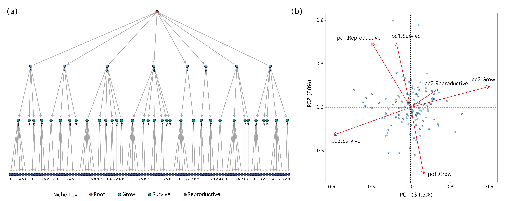

# MultiTraits

Plant functional traits and their multidimensional trade-offs represent fundamental aspects of plant ecological research. The MultiTraits R package integrates four complementary analytical modules: Competitor-Stress tolerator-Ruderal (CSR) strategy analysis, Leaf-Height-Seed (LHS) strategy analysis, Niche Periodicity Table (NPT) analysis, and Trait Network (TN) analysis, providing researchers with a comprehensive analytical platform. This tutorial aims to guide users through the core functionalities and practical applications of the MultiTraits package. Through practical demonstrations, we illustrate how these analytical modules can be utilized to explore multidimensional relationships among plant traits, including key steps in data preparation, analysis workflows, and result visualization.

## Installation

### From CRAN (recommended)

```{r,class.source = 'fold-show'}
# install.packages("MultiTraits")
```

### From GitHub (development version)

```{r,class.source = 'fold-show'}
# if (!requireNamespace("devtools", quietly = TRUE)) {install.packages("devtools")}
# devtools::install_github("biodiversity-monitoring/MultiTraits")
```

## Main Functions

| Module | Function              | Description                                                                                                             |
|-------------------|-----------------------|------------------------------|
| CSR    | CSR_strategy()        | Computes C-S-R ecological strategy coordinates for individual plant species based on key functional traits              |
|        | CSR()                 | Performs batch calculation of C-S-R strategies across multiple plant species simultaneously                             |
|        | CSR_plot()            | Generates publication-quality ternary plots for visualizing C-S-R strategy distributions                                |
| LHS    | LHS()                 | Analyzes and classifies plant species into ecological strategy types based on the Leaf-Height-Seed (LHS) trait spectrum |
|        | LHS_plot()            | Renders three-dimensional visualization of species distribution in LHS strategy space                                   |
|        | LHS_strategy_scheme() | Generates standardized classification scheme for LHS ecological strategies \^                                           |
| NPT    | NPT()                 | Implements hierarchical principal component analysis to identify ecological niche periodicity patterns                  |
|        | NPT_plot()            | Visualizes results of niche periodicity analysis through ordination plots                                               |
| TN     | TN_corr()             | Analyzes and visualizes correlation structure within plant trait networks                                               |
|        | TN()                  | Constructs functional trait networks based on specified correlation thresholds                                          |
|        | TN_metrics()          | Calculates network centrality metrics and topological properties                                                        |
|        | TN_plot()             | Renders customizable network graphs highlighting trait relationships                           

### Example Datasets: PFF (Pine Forests Flora)

The package includes a built-in example dataset called PFF that can be loaded as follows:

```{r,class.source = 'fold-show'}
library(MultiTraits)
data(PFF)
# View the structure of the datasets
head(PFF)
```

The PFF dataset contains trait measurements for plant species found in pine forests, with the following variables:

Height: Maximum plant height (cm)

Leaf_area: Leaf area (mm²)

LDMC: Leaf dry matter content (%)

SLA: Specific leaf area (mm²/mg)

SRL: Specific root length

SeedMass: Seed mass

FltDate: Flowering date

FltDur: Flowering duration

k_value: Decomposition rate

Leaf_Cmass: Leaf carbon content

Leaf_Nmass: Leaf nitrogen content

Leaf_CN: Leaf carbon/nitrogen ratio

Leaf_Pmass: Leaf phosphorus content

Leaf_NP: Leaf nitrogen/phosphorus ratio

Leaf_CP: Leaf carbon/phosphorus ratio

Root_Cmass: Root carbon content

Root_Nmass: Root nitrogen content

Root_CN: Root carbon/nitrogen ratio

### CSR Strategy

The CSR strategy analysis is based on Pierce et al.'s (2017) global CSR methodology, which uses three key leaf traits: Leaf Area (LA), Leaf Dry Matter Content (LDMC), and Specific Leaf Area (SLA). Using the MultiTraits package, we analyze these traits for 133 plant species from the PFF dataset. The CSR() function calculates the C, S, and R scores for each species, while CSR_plot() creates a ternary plot showing the distribution of species along the three strategy axes. This visualization helps identify whether species tend toward competitive (C), stress-tolerant (S), or ruderal (R) life strategies.

```{r,class.source = 'fold-show'}
# Load the PFF dataset
data(PFF)
head(PFF)

# Select required traits for CSR analysis
traits <- data.frame(LA=PFF$Leaf_area, LDMC=PFF$LDMC, SLA=PFF$SLA)
head(traits)

# Perform CSR analysis
result <- CSR(data = traits)
head(result)

# Visualize CSR strategy results
CSR_plot(data=result, expand_margin = 1)
```


### LHS Strategy

The LHS (Leaf-Height-Seed) strategy analysis is based on three key plant functional traits: specific leaf area (SLA), plant height, and seed mass. The LHS() function in the MultiTraits package classifies plants into eight ecological strategy types, reflecting trade-offs in resource acquisition, competitive ability, and reproductive strategies. The analysis results can be visualized in three-dimensional space using the LHS_plot() function, while LHS_strategy_scheme() illustrates the ecological significance of the eight strategy types. This analytical approach helps understand how plants adapt to environments through different trait combinations.

```{r,class.source = 'fold-show'}
# Load the PFF dataset
data(PFF)
# Select specific columns (SLA, Height, SeedMass) from the PFF dataset
pff <- PFF[, c("SLA", "Height", "SeedMass")]
head(pff)

# Perform LHS (Leaf-Height-Seed) analysis on the selected data
result <- LHS(pff)
head(result)
table(result$LHS_strategy)

# Create a visualization plot of the LHS analysis results
LHS_plot(result)

# Display the LHS strategy scheme diagram
LHS_strategy_scheme()
```


### Niche Periodicity Table

The Niche Periodicity Table (NPT) analysis employs a "PCA of PCAs" approach to explore how plant functional traits are distributed across environmental gradients. While traditionally organized into three fundamental dimensions - growth, survival, and reproduction - these dimensions are not fixed and can be customized according to specific research questions and hypotheses. The NPT function processes these trait dimensions (whether three or more) to create a comprehensive view of plant ecological strategies, while NPT_plot generates visualizations that can be enhanced by adding taxonomic information such as plant family classifications.

```{r,class.source = 'fold-show'}
# Load the PFF dataset
data(PFF)
# Log-transform columns 3-20 of the dataset
PFF[,3:20] <- log(PFF[,3:20])
# Remove rows with missing values (NA)
PFF <- na.omit(PFF)
head(PFF)

# Define trait dimensions for NPT analysis
traits_dimension <-list(
  grow = c("SLA","Leaf_area","LDMC","SRL","Leaf_Nmass","Leaf_Pmass","Root_Nmass"),
  survive = c("Height","Leaf_Cmass","Root_Cmass","Leaf_CN","Leaf_NP","Leaf_CP","Root_CN"),
  reproductive = c("SeedMass","FltDate","FltDur"))
# Perform NPT analysis using the defined dimensions
npt_result <- NPT(data = PFF, dimension = traits_dimension)
npt_result

# Create a basic visualization of NPT results
NPT_plot(npt_result$result)
# Create a visualization of NPT results colored by plant family
NPT_plot(npt_result$result, PFF$family)
```


### Trait Network

The Trait Network (TN) analysis module enables exploration of complex relationships between multiple plant traits. Using correlation analysis (Pearson or Spearman), it creates a network where traits are nodes and significant correlations form edges. The TN() function analyzes relationships, TN_corr() visualizes correlations, TN_metrics() calculates network properties, and TN_plot() offers two visualization styles. In the example, 17 key plant traits from the PFF dataset are analyzed, with correlations filtered by significance thresholds (rThres=0.2, pThres=0.05) after log transformation and NA removal.

```{r,class.source = 'fold-show'}
# Load the PFF dataset
data(PFF)

# Select specific trait columns for analysis
PFF_traits <- PFF[, c("Height", "Leaf_area","LDMC","SLA","SRL","SeedMass","FltDate","FltDur","Leaf_Cmass","Leaf_Nmass",
                      "Leaf_CN","Leaf_Pmass","Leaf_NP","Leaf_CP","Root_Cmass","Root_Nmass","Root_CN") ]
# Perform log transformation of data and remove missing values
PFF_traits <- log(na.omit(PFF_traits))
head(PFF_traits)

# Calculate trait correlations using specified thresholds
TN_corr(traits_matrix=PFF_traits, rThres = 0.2, pThres = 0.05,method = "pearson")

# Perform Trait Network (TN) analysis
Tn_result <- TN(traits_matrix = PFF_traits, rThres = 0.2, pThres = 0.05,method = "pearson")
Tn_result

# Calculate network metrics for the trait network
TN_metrics(Tn_result)

# Create visualization plots of the trait network
par(mfrow=c(1,2))
# Style 1
TN_plot(Tn_result, style = 1,vertex.size = 10,vertex.label.cex = 0.6)
# Style 2
TN_plot(Tn_result, style = 2,vertex.size = 20,vertex.label.cex = 0.6)
```



